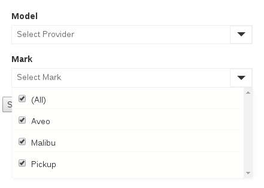

# Select3 (yii2-select3)

Display a hybrid between a DropDownList and a  Multi-selectable checkboxes.

platform:  Yii Framework 2.0

author:  Cristian Salazar  chileshift.cl/freesoftwarefactory

## Preview



## Usage

1. Via composer, 
```
"require": {
    "php": ">=5.4.0",
	"freesoftwarefactory/yii2-select3": "(put version here)"
},
```

2. In your View

```
<?php
use yii\widgets\ActiveForm;
use freesoftwarefactory\select3\Select3Widget;

$options = 
[
    'opt1' => "Chevrolet",
    'opt2' => "Mazda",
    'opt3' => "Audi",
];


?>

<?php $form = ActiveForm::begin( [ 'id'=>'form1', ]); ?>

<div class='row'>
    <div class='col-md-3'>
        <?=$form->field($model, 'someAttributeInYourModel')
            ->widget(Select3Widget::className(), 
                [
                    'prompt' => 'Select Provider',
                    'options' => $options,
                    'allSelectable' => true,
                    'allSelectableLabel' => "(All)",
                    'visibleAtStartup' => false,
                ]) ?>
    </div>
</div>

<?php ActiveForm::end(); ?>
```

## Receving Values from this Control

Values are base64+json encoded, that is, when you submits a form using this
control then you will have something similar to:

```
eyJvcHQxIjp0cnVlLCJvcHQyIjp0cnVlLCJvcHQzIjpmYWxzZX0=
```

Which is a base64 encoded version of this:

```
 {"opt1":true,"opt2":true,"opt3":false}
```

So, you can just call:

```
$values = json_decode(base64_decode($model->yourAttribute),true);
```

Or... just call :)

```
$values =  Select3Widget::getDecodedValueFrom($model, 'yourAttribute');
```

## More functions

1. load items via javascript by calling:

```
$.fn.select3load($('#widgetid') , { 123 : some , 456 : thing });
```

2. Disable the control by passing:

```
[
    'disable'=>true,
]
```

3. Disable/Check some items at startup by calling

```
[
    'disabledOptions' => ['somekeydisabled'],

    'autoSelectOptions' => ['somekeySelectedFromTheBeginning'],
]
```

